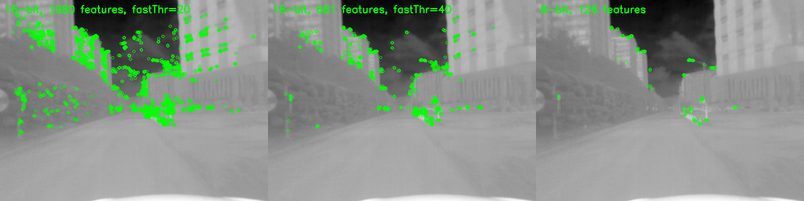

# ORB (Oriented Fast and Rotated BRIEF) for 16-bit image
## C++ and Python interface for ORB feature extraction



This repository is a wrapper for well-known feature extractor, ORB, to make it use of **16-bit image**.\
Unlike normal RGB 8-bit image, TIR (Thermal-Infrared) image contains 14-bit information.\
It has been a practice to convert (normalize) TIR image into 8-bit, and then apply traditional 8-bit feature extractor to it.\
But we argue that it can be better to **detect and describe features from raw 14-bit image**. \
Advantages of using raw 14-bit image is ...
1.  preserve raw intensity information
2.  make image irrelevent to the normalization method
3.  detect more features

We provide ready-to-use C++ and Python interface.
Most of the code is from official OpenCV, and we slightly changed the part of them.

## How to use
Clone and build the repository.
```
git clone https://github.com/HyeonJaeGil/ORB16.git && cd ORB16
git submodule update --init --recursive
```

### to use C++ interface only
```
# build
mkdir build && cd build && cmake .. && make

# test
./test_ORB16
```

### to use Python interface
```
# build
pip install -e . 

# test
python python/test_pyorb.py
```

